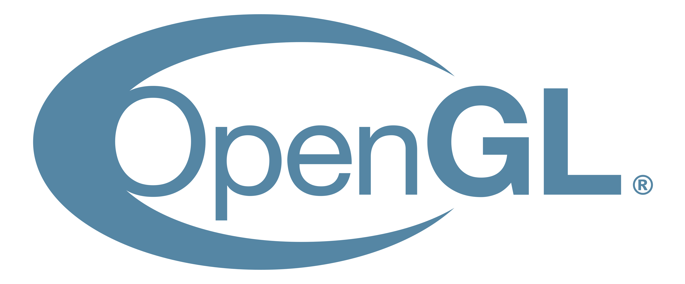
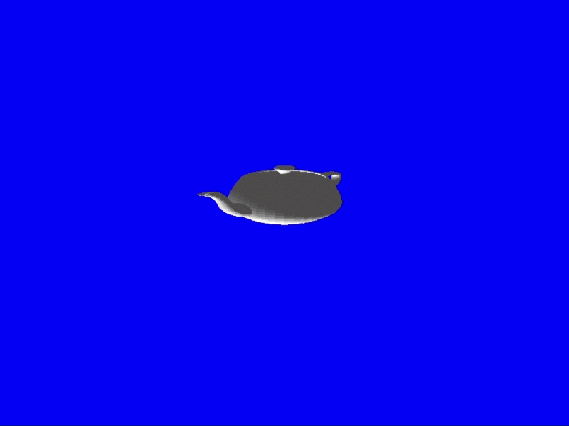

# Projeto-Processamento-Grafico

<a id="readme-top"></a>

[![Contributors][contributors-shield]][contributors-url]
[![Issues][issues-shield]][issues-url]
[![MIT License][license-shield]][license-url]

<!-- PROJECT LOGO -->
<div align="center">
  
  


</div>

</div>

<!-- TABLE OF CONTENTS -->
 <details>
  <summary><strong>Índice</strong></summary>
  <ol>
    <li><a href="#sobre-o-projeto">Sobre o Projeto</a></li>
    <li><a href="#ferramentas">Ferramentas</a></li>
    <li><a href="#objetivos">Objetivos</a></li>
    <li><a href="#pré-requisitos">Pré-requisitos</a></li>
    <li><a href="#execução">Execução</a></li>
    <li><a href="#uso">Uso</a></li>
    <li><a href="#controles">Controles</a></li>
    <li><a href="#features">Features</a></li>
    <li><a href="#desenvolvedor">Desenvolvedor</a></li>
    <li><a href="#licença">Licença</a></li>
    <li><a href="#contato">Contato</a></li>
  </ol>
</details>

<!-- ABOUT THE PROJECT -->
## Sobre o projeto

Este projeto foi desenvolvido com o objetivo de aplicar os conceitos estudados na disciplina de Processamento Gráfico, através da criação e visualização de uma cena 3D interativa.
O projeto foi realizado utilizando o GitHub para documentação das alterações realizadas.


## Ferramentas

Essa seção lista as principais ferramentas utilizadas no desenvolvimento do projeto.

* 
* 
* 
* [![Git][Git.com]][Git-url]
* [![Linux][Linux.com]][Linux-url]

## Objetivos

Desenvolver uma cena 3D funcional implementando conceitos fundamentais de computação gráfica, incluindo:

* Renderização de objetos 3D
* Uso de shaders
* Manipulação de câmera
* Aplicação de texturas
* Animação básica
* Redimencionamento


<a id="pre-requisitos"></a>
## Pré requisitos

Antes de começar, você precisará de:

- Compilador C/C++ (recomendado: GCC)

Verifique se já possui instalado:
  ```sh
  gcc –version
  ```

### Dependências

#### 🪟 Windows (MinGW)

É necessário baixar manualmente a biblioteca GLFW:

https://www.glfw.org/download

Após o download:

1. Extraia o arquivo  
2. Copie a pasta `GLFW.3.4` para dentro do diretório `GLFW` do projeto  

---

#### 🐧 Linux (Ubuntu/Debian)

No Linux, não é necessário baixar o GLFW manualmente.

Instale as dependências com:

```sh
sudo apt update
sudo apt install libglfw3-dev libgl1-mesa-dev libxi-dev
```

### Execução

Aqui o passo a passo de como executar o projeto.

1. Clone o repositorio
   ```sh
   git clone https://github.com/igor-Ianes/Projeto-Processamento-Grafico
   ```
2. Dentro da pasta Projeto cole a pasta GLFW.3.4 na pasta GLFW (Apenas Windows). 
   ```js
   cd projeto
   ```
3. A estrutura final do projeto deve ser esta.
   ```js
    Projeto/
    ├── Assets/
    │   ├── TextureDragon.png
    │   ├── AsaEsquerda.obj
    │   ├── AsaDireita.obj
    │   ├── MontanhaNeve.obj
    │   └── Grama.jpg
    │   
    ├── GLFW/
    │   └── Glfw-3.4/
    │       └── ...
    │
    ├── Glad/ 
    │   └── ...
    │
    ├── Graficos3d/
    │   ├── Headers/
    │   │   ├── Framework/
    │   │   │   ├── Graphics.hpp
    │   │   │   ├── InputManager.hpp
    │   │   │   ├── Manager.hpp
    │   │   │   ├── MathHelper.hpp
    │   │   │   ├── stb_Image.hpp
    │   │   │   ├── TextureManager.hpp
    │   │   │   └── Timer.hpp
    │   │   │ 
    │   │   └── Engine/
    │   │       ├── Camera.hpp
    │   │       ├── Graphics3d.hpp
    │   │       ├── Math3d.hpp
    │   │       ├── Mesh.hpp
    │   │       ├── Object3D.hpp
    │   │       ├── OpenGL.hpp
    │   │       ├── Renderer3D.hpp
    │   │       ├── Scene.hpp
    │   │       └── Shader.hpp
    │   │
    │   └── Source/
    │       ├── Engine/
    │       │   ├── Graphics3d.cpp
    │       │   ├── Math3d.cpp
    │       │   ├── Renderer3D.cpp
    │       │   ├── Scene.cpp
    │       │   └── Shader.cpp
    │       └── Framework/
    │       │   ├── Graphics.cpp
    │       │   ├── InputManager.cpp
    │       │   ├── Manager.cpp
    │       │   ├── TextureManager.cpp
    │       │   └── Timer.cpp
    │       └── main.cpp
    └── MAKEFILE
   ```

4. execute o  `MAKEFILE` com o seguinte comando.
   ```js
   make all
   ```


## Uso

Alguns exemplos da engine em execução:

### Demonstrações básicas
<p align="center">
  
  
</p>
<p align="center"><em>Teapot e cubo renderizados pela engine</em></p>

### Cena dos Dragões
<p align="center">
  
</p>
<p align="center"><em>Cena completa com múltiplos dragões</em></p>

### Transformações (Cena dos Dragões)
<p align="center">
  
  
</p>
<p align="center"><em>Demonstrações de escala e rotação aplicadas à cena</em></p>

## Controles

A seguir seguem todos os controles da engine.

- `W, A, D, S, F, G`: Movimentação da camera.
- `↑ ↓ ← →`: movimentação do objeto selecionado.
- `M, N, B, V`: movimentação do objeto selecionado no proprio eixo.
- `1, 2, 3, 4, -, +`: Redimensionamento do objeto selecionado.
- `TAB`: seleciona proximo objeto em loop.
- `C`: troca de camera.
- `Mouse`: Movimenta camera e da zoom.


## Features:
o projeto teve como features implementadas:

* Renderização de objetos 3D a partir de um parser de .OBJ
* Iluminação basica
* movimentação dos objetos em todas as direções
* Possibilidade de alternar entre os objetos
* Possibilidade de se movimentar pela cena atraves de 3 cameras
* Utilização de Shader próprio
* Possibilidade de redimensionar qualquer objeto
* Suporte a textura
* Suporte a rotação e orbita de objetos
* Suporte a hierarquia nos objetos

### Shaders

#### Vertex Shader
   ```cpp
   const char *vs = "#version 330 core\n"
                     "layout (location = 0) in vec3 aPos;\n"
                     "layout (location = 1) in vec3 aNormal;\n"
                     "layout (location = 2) in vec2 aTex;\n"
                     "\n"
                     "out vec2 TexCoord;\n"
                     "out vec3 Normal;\n"
                     "out vec3 FragPos;\n"
                     "\n"
                     "uniform mat4 mvp;\n"
                     "uniform mat4 model;\n"
                     "\n"
                     "void main()\n"
                     "{\n"
                     "    vec4 worldPos = model * vec4(aPos, 1.0);\n"
                     "    FragPos = worldPos.xyz;\n"
                     "\n"
                     "    Normal = mat3(transpose(inverse(model))) * aNormal;\n"
                     "    TexCoord = aTex;\n"
                     "\n"
                     "    gl_Position = mvp * vec4(aPos, 1.0);\n"
                     "}";
   ```
#### Fragment Shader
   ```sh
   const char *fs = "#version 330 core\n"
                     "in vec2 TexCoord;\n"
                     "in vec3 Normal;\n"
                     "in vec3 FragPos;\n"
                     "\n"
                     "out vec4 FragColor;\n"
                     "\n"
                     "uniform sampler2D texture1;\n"
                     "uniform bool useTexture;\n"
                     "uniform vec3 objColor;\n"
                     "uniform vec3 lightDir;\n"
                     "\n"
                     "void main()\n"
                     "{\n"
                     "    vec3 baseColor;\n"
                     "\n"
                     "    if (useTexture)\n"
                     "        baseColor = texture(texture1, TexCoord).rgb;\n"
                     "    else\n"
                     "        baseColor = objColor;\n"
                     "\n"
                     "    vec3 norm = normalize(Normal);\n"
                     "    vec3 light = normalize(lightDir);\n"
                     "\n"
                     "    float diff = max(dot(norm, light), 0.1);\n"
                     "\n"
                     "    vec3 ambient = baseColor * 0.2;\n"
                     "    vec3 diffuse = baseColor * diff;\n"
                     "\n"
                     "    vec3 result = ambient + diffuse;\n"
                     "\n"
                     "    FragColor = vec4(result, 1.0);\n"
                     "}";
   ```


## Desenvolvedor:
* Nome: Igor Ianes
* RA: 795593


<!-- LICENSE -->
## Licença

Distribuição sob a licença MIT. Veja `LICENSE.txt` para maiores informações.


<!-- CONTACT -->
## Contato

[](https://mail.google.com/mail/?view=cm&to=igor.ianes@estudante.ufscar.br)

Project Link: [https://github.com/igor-Ianes/Projeto-Processamento-Grafico](https://github.com/igor-Ianes/Projeto-Processamento-Grafico)

<p align="right">(<a href="#readme-top">back to top</a>)</p>


<!-- MARKDOWN LINKS & IMAGES -->
<!-- https://www.markdownguide.org/basic-syntax/#reference-style-links -->
[contributors-shield]: https://img.shields.io/github/contributors/igor-Ianes/Projeto-Processamento-Grafico.svg?style=for-the-badge
[contributors-url]: https://github.com/igor-Ianes/Projeto-Processamento-Grafico/graphs/contributors
[forks-shield]: https://img.shields.io/github/forks/igor-Ianes/Projeto-Processamento-Grafico.svg?style=for-the-badge
[forks-url]: https://github.com/igor-Ianes/Projeto-Processamento-Grafico/network/members
[stars-shield]: https://img.shields.io/github/stars/igor-Ianes/Projeto-Processamento-Grafico.svg?style=for-the-badge
[stars-url]: https://github.com/igor-Ianes/Projeto-Processamento-Grafico/stargazers
[issues-shield]: https://img.shields.io/github/issues/igor-Ianes/Projeto-Processamento-Grafico.svg?style=for-the-badge
[issues-url]: https://github.com/igor-Ianes/Projeto-Processamento-Grafico/issues
[license-shield]: https://img.shields.io/github/license/igor-Ianes/Projeto-Processamento-Grafico.svg?style=for-the-badge
[license-url]: https://github.com/igor-Ianes/Projeto-Processamento-Grafico/blob/master/LICENSE.txt
[linkedin-shield]: https://img.shields.io/badge/-LinkedIn-black.svg?style=for-the-badge&logo=linkedin&colorB=555
[linkedin-url]: https://www.linkedin.com/in/igor-c-i-a8522920a/
[Git.com]:https://img.shields.io/badge/GIT-E44C30?style=for-the-badge&logo=git&logoColor=white
[Git-url]:https://Git.com
[Linux.com]:https://img.shields.io/badge/Linux-000?style=for-the-badge&logo=linux&logoColor=FCC624
[Linux-url]:https://linux.com
